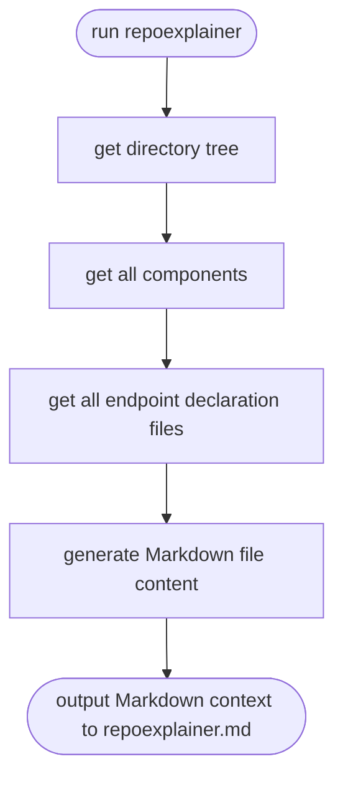

# repoexplainer
Generate a Markdown file to describe an existing repo, so that developer could explain whole repo to AI chatbot more easily.  

## directory structure
```
/repoexplainer
  /cmd
    main.go
  /example
    /repo_explainer
    /chatroom_service
  /component_finder
    /go
      struct.go
      interface.go
      function.go
      const.go
      var.go
  /endpoint_finder
    /go
      echo.go
      aws_apigateway.go
      grpc.go
  /markdowngen
      dir_tree.go
      finder_factory.go
      generator.go
  go.mod
```

## how does it work


## what does the markdown file look like
repoexplainer.md example 
```
# repo name

## directory structure

/user
  /cmd
    /echo
      main.go
    /aws_lambda
      main.go
  /internal
    /service
      user.go
    /repo
      dynamodb.go
    /handler
      echo.go
      aws_apigateway.go
  README.md
  go.mod

## components
 - dir: /internal/service
     - UserService
         - file: /user/internal/service/user.go
         - package: service
         - type: struct
         - fields: 
             - UserRepo
         - methods:
             - GetUser(userID string) model.User
             - AddUser(user model.User) (string, error)
             - UpdateUser(user model.User) (model.User, error)
     - NewDefaultUserService(userRepo user.UserRepo) (*DefaultUserService, error)
         - file: /user/internal/service/user.go
         - package: service
         - type: function
         - fields: none
         - methods: none
     - UserRepo
         - file: /user/internal/service/user.go
         - package: service
         - type: interface
         - fields: none
         - methods:
             - GetUser(userID string) model.User
             - PutUser(user model.User) error
 - dir: /internal/repo
     - DynamodbUserRepo
         - file: /user/internal/repo/dynamodb.go
         - package: repo
         - type: struct
         - fields:
             - client *dynamodb.Client
	         - tableName string
         - methods: 
             - GetUser(userID string) model.User
             - PutUser(user model.User) error
     - NewDynamodbUserRepo() (*DynamodbUserRepo, error)
         - file: /user/internal/repo/dynamodb.go
         - package: repo
         - type: function
         - fields: none
         - methods: none
 - dir: /internal/handler
     - UserService
         - file: /user/internal/handler/echo.go
         - package: handler
         - type: interface
         - fields: none
         - methods:
             - GetUser(userID string) model.User
             - AddUser(user model.User) (string, error)
             - UpdateUser(user model.User) (model.User, error)
     - EchoHandler
         - file: /user/internal/handler/echo.go
         - package: handler
         - type: struct
         - fields:
             - userService UserService
         - methods:
             - GetUser(c echo.Context) error
             - AddUser(c echo.Context) error
             - UpdateUser(c echo.Context) error
     - NewEchoHandler(userService user.UserService) EchoHandler
         - file: /user/internal/handler/echo.go
         - package: handler
         - type: function
         - fields: none
         - methods: none
     - ApigatewayHandler
         - file: /user/internal/handler/aws_apigateway.go
         - package: handler
         - type: struct
         - fields:
             - userService UserService
         - methods:
             - GetUser(ctx context.Context, request events.APIGatewayV2HTTPRequest,)(events.APIGatewayV2HTTPResponse, error)
             - AddUser(ctx context.Context, request events.APIGatewayV2HTTPRequest,)(events.APIGatewayV2HTTPResponse, error)
             - UpdateUser(ctx context.Context, request events.APIGatewayV2HTTPRequest,)(events.APIGatewayV2HTTPResponse, error)
     - NewApiGatewayHandler(userService user.UserService) ApiGatewayHandler
         - file: /user/internal/handler/aws_apigateway.go
         - package: handler
         - type: function
         - fields: none
         - methods: none
 - dir: /cmd/echo
     - main()
         - file: /user/cmd/echo/main.go
         - package: main
         - type: function
         - fields: none
         - methods: none
 - dir: /cmd/aws_lambda
     - main()
         - file: /user/cmd/aws_lambda/main.go
         - package: main
         - type: function
         - fields: none
         - methods: none

## endpoints
 - server 1:
     - file: /user/cmd/echo/main.go
     - context:
        ```
        package main

        import (
            "log"

            "github.com/labstack/echo/v4"
            "local/user/internal/user/handler"
            "local/user/internal/user/repo"
            "local/user/internal/user/service"
        )

        func main() {
            userRepo, err := repo.NewDynamodbUserRepo()
            if err != nil {
                log.Fatalf("can't new a DynamodbUserRepo: %s", err.Error())
            }

            userService, err := service.NewUserService(userRepo, userPicRepo)
            if err != nil {
                log.Fatalf("can't new a SimpleUserService: %s", err.Error())
            }

            handler := handler.NewEchoHandler(userService)

            e := echo.New()
            e.GET("/user", handler.GetUsers)
            e.POST("/user", handler.AddUser)
            e.PUT("/user", handler.UpdateUser)

            e.Logger.Fatal(e.Start(":1323"))
        }
        ```
 - server 2:
     - file: /user/cmd/aws_lambda/main.go
     - context:
        ```
        package main

        import (
            "context"
            "fmt"
            "log"
            "net/http"

            "github.com/aws/aws-lambda-go/events"
            "github.com/aws/aws-lambda-go/lambda"
            "local/user/internal/user/handler"
            "local/user/internal/user/repo"
            "local/user/internal/user/service"
        )

        const (
            routeUser       = "v1/user"
        )

        var userService handler.UserService

        func handleRequest(ctx context.Context, request events.APIGatewayV2HTTPRequest,
        ) (events.APIGatewayV2HTTPResponse, error) {
            log.Printf("request: %+v\n", request)

            handler := handler.NewApiGatewayHandler(userService)

            switch request.PathParameters["proxy"] {
            case routeUser:
                switch request.RequestContext.HTTP.Method {
                case http.MethodGet:
                    return handler.GetUsers(ctx, request)
                case http.MethodPost:
                    return handler.AddUser(ctx, request)
                case http.MethodPut:
                    return handler.UpdateUser(ctx, request)
                default:
                    return events.APIGatewayV2HTTPResponse{
                        StatusCode: http.StatusNotFound,
                        Body:       fmt.Sprintf("unsupported HTTP method: %s", request.RequestContext.HTTP.Method),
                    }, nil
                }
            default:
                return events.APIGatewayV2HTTPResponse{
                    StatusCode: http.StatusNotFound,
                    Body:       fmt.Sprintf("can't find path: %s", request.PathParameters["proxy"]),
                }, nil
            }
        }

        func main() {
            userRepo, err := repo.NewDynamodbUserRepo()
            if err != nil {
                log.Fatalf("can't new a DynamodbUserRepo: %s", err.Error())
            }

            userService, err = service.NewDefaultUserService(userRepo, userPicRepo)
            if err != nil {
                log.Fatalf("can't new a SimpleUserService: %s", err.Error())
            }

            lambda.Start(handleRequest)
        }

        ```
```