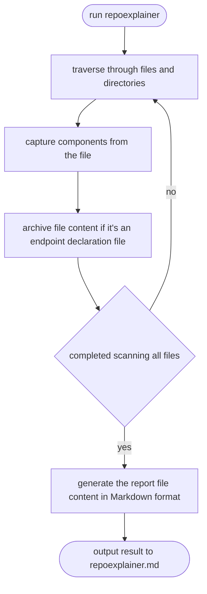

# repoexplainer
Generate a Markdown file to describe an existing repo, so that developer could explain whole repo to AI chatbot more easily.  

## directory structure
```
/repoexplainer
  /cmd
    main.go
  /example
    /repo_explainer
    /chatroom_service
  /component_finder
    /golang
      struct.go
      interface.go
      function.go
      global.go
  /reportgen
      dir_tree.go
      finder_factory.go
      generator.go
      interface.go
      model.go
  go.mod
```

## how does it work


## what does the markdown file look like
repoexplainer.md example 
```
# repo name

## directory structure

/user
  /cmd
    /echo
      main.go
    /aws_lambda
      main.go
  /internal
    /service
      user.go
    /repo
      dynamodb.go
    /handler
      echo.go
      aws_apigateway.go
  README.md
  go.mod

## components
 - dir: /internal/service
     - UserService
         - file: /user/internal/service/user.go
         - package: service
         - type: struct
         - fields: 
             - UserRepo
         - methods:
             - GetUser(userID string) model.User
             - AddUser(user model.User) (string, error)
             - UpdateUser(user model.User) (model.User, error)
     - NewDefaultUserService(userRepo user.UserRepo) (*DefaultUserService, error)
         - file: /user/internal/service/user.go
         - package: service
         - type: function
         - fields: none
         - methods: none
     - UserRepo
         - file: /user/internal/service/user.go
         - package: service
         - type: interface
         - fields: none
         - methods:
             - GetUser(userID string) model.User
             - PutUser(user model.User) error
 - dir: /internal/repo
     - DynamodbUserRepo
         - file: /user/internal/repo/dynamodb.go
         - package: repo
         - type: struct
         - fields:
             - client *dynamodb.Client
	         - tableName string
         - methods: 
             - GetUser(userID string) model.User
             - PutUser(user model.User) error
     - NewDynamodbUserRepo() (*DynamodbUserRepo, error)
         - file: /user/internal/repo/dynamodb.go
         - package: repo
         - type: function
         - fields: none
         - methods: none
 - dir: /internal/handler
     - UserService
         - file: /user/internal/handler/echo.go
         - package: handler
         - type: interface
         - fields: none
         - methods:
             - GetUser(userID string) model.User
             - AddUser(user model.User) (string, error)
             - UpdateUser(user model.User) (model.User, error)
     - EchoHandler
         - file: /user/internal/handler/echo.go
         - package: handler
         - type: struct
         - fields:
             - userService UserService
         - methods:
             - GetUser(c echo.Context) error
             - AddUser(c echo.Context) error
             - UpdateUser(c echo.Context) error
     - NewEchoHandler(userService user.UserService) EchoHandler
         - file: /user/internal/handler/echo.go
         - package: handler
         - type: function
         - fields: none
         - methods: none
     - ApigatewayHandler
         - file: /user/internal/handler/aws_apigateway.go
         - package: handler
         - type: struct
         - fields:
             - userService UserService
         - methods:
             - GetUser(ctx context.Context, request events.APIGatewayV2HTTPRequest,)(events.APIGatewayV2HTTPResponse, error)
             - AddUser(ctx context.Context, request events.APIGatewayV2HTTPRequest,)(events.APIGatewayV2HTTPResponse, error)
             - UpdateUser(ctx context.Context, request events.APIGatewayV2HTTPRequest,)(events.APIGatewayV2HTTPResponse, error)
     - NewApiGatewayHandler(userService user.UserService) ApiGatewayHandler
         - file: /user/internal/handler/aws_apigateway.go
         - package: handler
         - type: function
         - fields: none
         - methods: none
 - dir: /cmd/echo
     - main()
         - file: /user/cmd/echo/main.go
         - package: main
         - type: function
         - fields: none
         - methods: none
 - dir: /cmd/aws_lambda
     - main()
         - file: /user/cmd/aws_lambda/main.go
         - package: main
         - type: function
         - fields: none
         - methods: none
```

## details about how to build repoexplain from scratch
### componenets
 - package: reportgen
   - ComponentFinder (interface):  
     Componentfinder finds the definition of components like interface, struct, function ...etc. It takes one line of code as input and the input lines will always be continuous in a same file before reading the "EOF". The finder still store the component and provide getter for others to access these components.
   - FileTraverser (struct): Use current directory as the root of a tree, traverse through all files in the file tree. Except providing the next file, FileTraverser also store the path of each file and could print the directory structure after the traverse is finished.
   - ReportGenerator (struct): Use FileTraverser and CompnentFinder to generate the report markdown file in the format mentioned above.  
   - FinderFactory (struct): All finder should be registered here. ReportGenerator will use FinderFactory to generate all finders. 
### models
 - package: reportgen
   - Component
     - file: /repoexplainer/reportgen/model.go
     - content:
       ```
       type Component struct {
            File    string `json:"file"`
            Package string `json:"package"`
            Type    string `json:"type"`
            Fields  []string `json:"fields"`
            Methods []string `json:"methods"`
       }
       ``` 
   - ComponentMap
     - file: /repoexplainer/reportgen/model.go
     - content:
       ```
       // the key is the last two directory name, ex: /internal/repo
       type ComponentMap map[string][]Component
       ``` 

