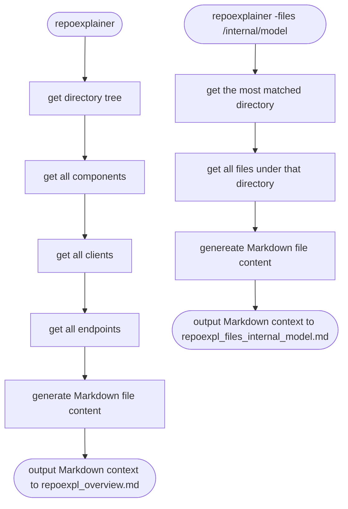

# repoexplainer
Generate a Markdown file to describe an existing repo, so that developer could explain whole repo to AI chatbot more easily.  

## directory structure
```
/repo_explainer
  /cmd
    main.go
  /example
    /repo_explainer
    /chatroom_service
  /component_finder
    /go
      struct.go
      interface.go
      function.go
  /client_finder
    /go
      /database
        sqlx.go
        dynamodb.go
      /messageq
        kafka.go
  /endpoint_finder
    /go
      echo.go
      aws_apigateway.go
      grpc.go
  /markdowngen
      dir_tree.go
      files_print.go
      finder_factory.go
      generator.go
  go.mod
```

## how does it work


## what does the markdown file look like
repoexpl_overview.md example 
```
# repo name

## directory structure

/user
  /cmd
    main.go
  /internal
    /service
      user.go
    /repo
      dynamodb.go
    /handler
      echo.go
      aws_apigateway.go
  README.md
  go.mod

## components
 - package: service
     - UserService
         - file: /user/internal/service/user.go
         - type: struct
         - fields: 
             - UserRepo
         - methods:
             - GetUser(userID string) model.User
             - AddUser(user model.User) (string, error)
             - UpdateUser(user model.User) (model.User, error)
     - UserRepo
         - file: /user/internal/service/user.go
         - type: interface
         - fields:
         - methods:
             - GetUser(userID string) model.User
             - PutUser(user model.User) error
 - package: repo
     - DynamodbUserRepo
         - file: /user/internal/repo/dynamodb.go
         - type: struct
         - fields:
             - client *dynamodb.Client
	         - tableName string
         - methods: 
             - GetUser(userID string) model.User
             - PutUser(user model.User) error
 - package handler
     - UserService
         - file: /user/internal/handler/echo.go
         - type: interface
         - fields: 
         - methods:
             - GetUser(userID string) model.User
             - AddUser(user model.User) (string, error)
             - UpdateUser(user model.User) (model.User, error)
     - EchoHandler
         - file: /user/internal/handler/echo.go
         - type: struct
         - fields:
             - userService UserService
         - methods:
             - GetUser(c echo.Context) error
             - AddUser(c echo.Context) error
             - UpdateUser(c echo.Context) error
     - ApigatewayHandler
         - file: /user/internal/handler/aws_apigateway.go
         - type: struct
         - fields:
             - userService UserService
         - methods:
             - GetUser(ctx context.Context, request events.APIGatewayV2HTTPRequest,)(events.APIGatewayV2HTTPResponse, error)
             - AddUser(ctx context.Context, request events.APIGatewayV2HTTPRequest,)(events.APIGatewayV2HTTPResponse, error)
             - UpdateUser(ctx context.Context, request events.APIGatewayV2HTTPRequest,)(events.APIGatewayV2HTTPResponse, error)
 - package main
     - main
         - file: /user/cmd/main.go
         - type: function
         - fields: 
         - methods:
```