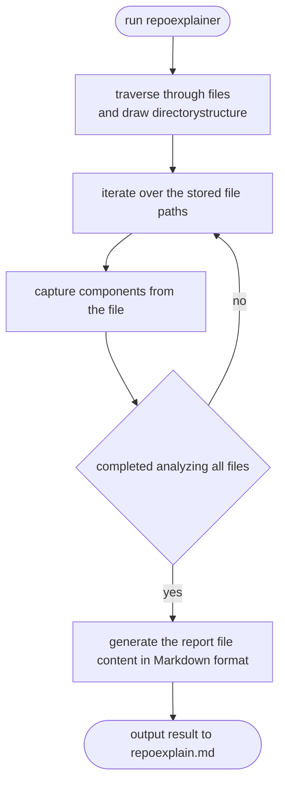

# repoexplainer
Generate a Markdown file to describe an existing repo, so that developer could explain whole repo to AI chatbot more easily.   

As a ChatGPT-4 heavy user, I use it a lot when I'm programming.  
And quite often I need to describe me local/private repo to it for it to understand what I'm doing.  
I hope this tool will make it eaiser fro developers to communicate with chat-based AI.  

## how does it work

## what does the markdown file look like
check repoexplain.md example: [line](https://github.com/burwei/repoexplainer/blob/main/repoexplain.md)
